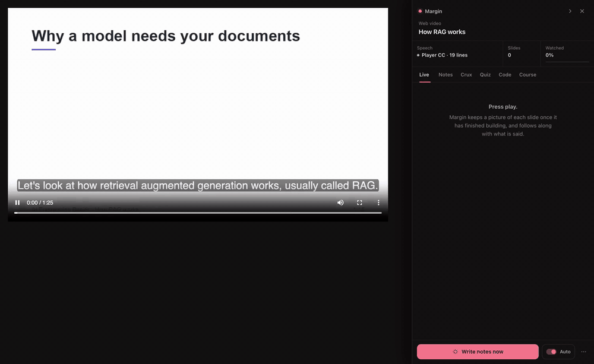
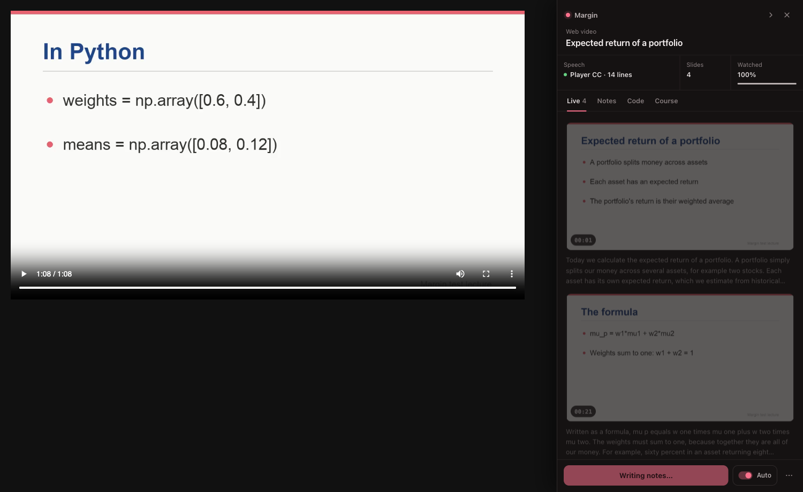
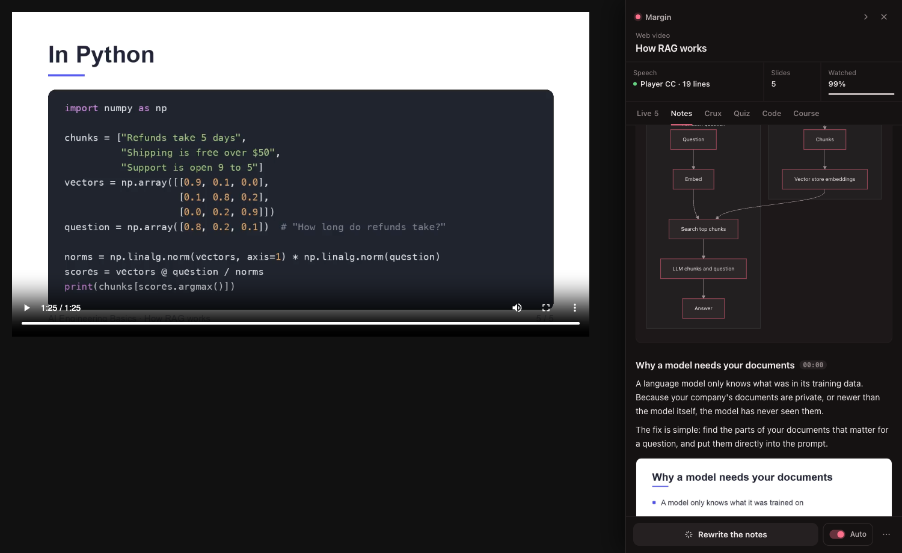
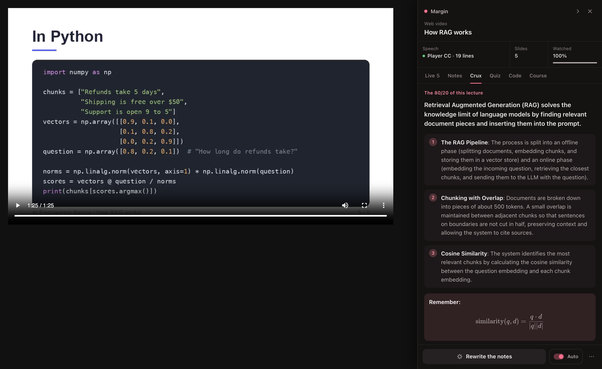
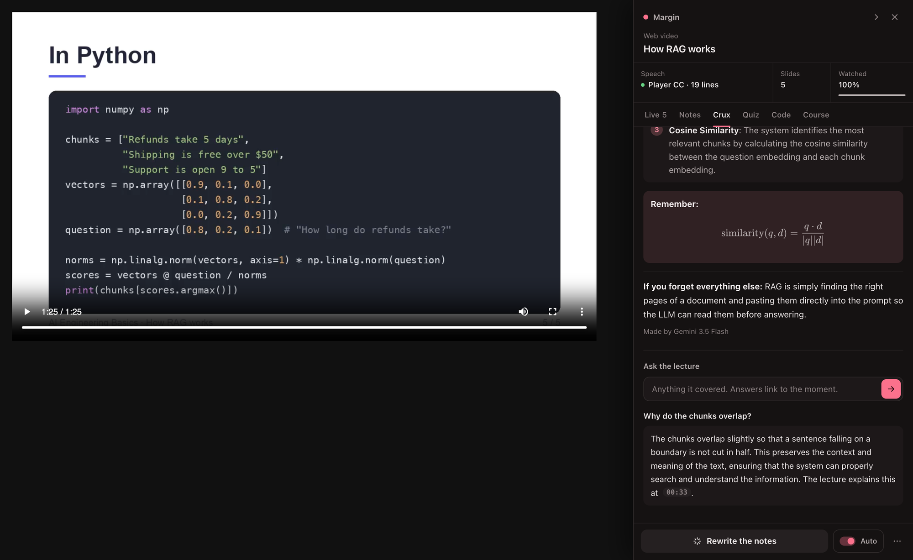
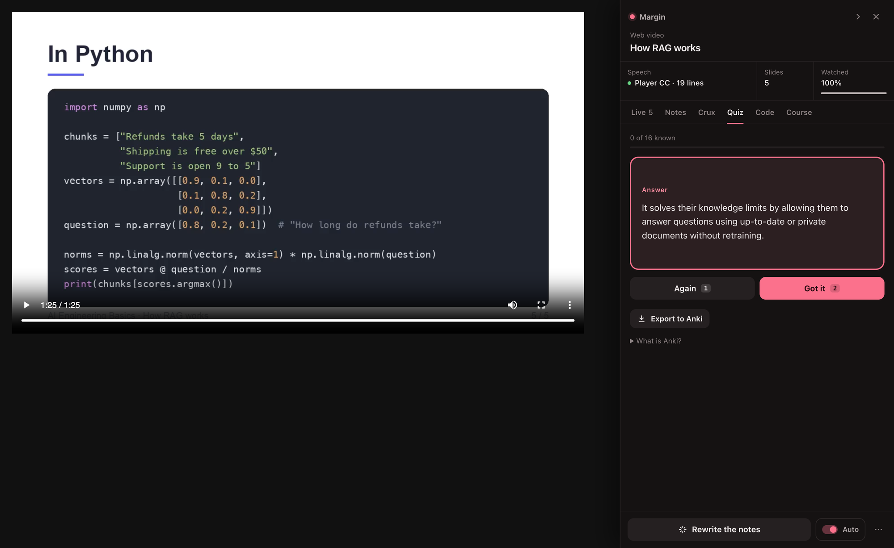
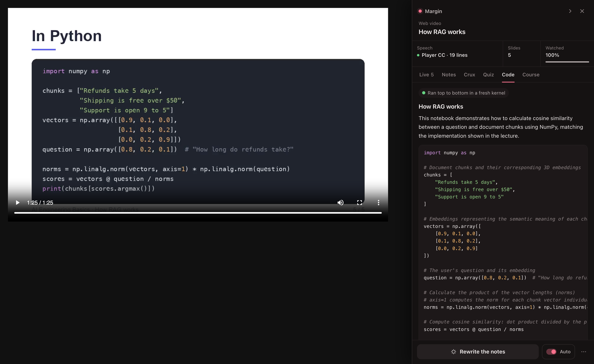
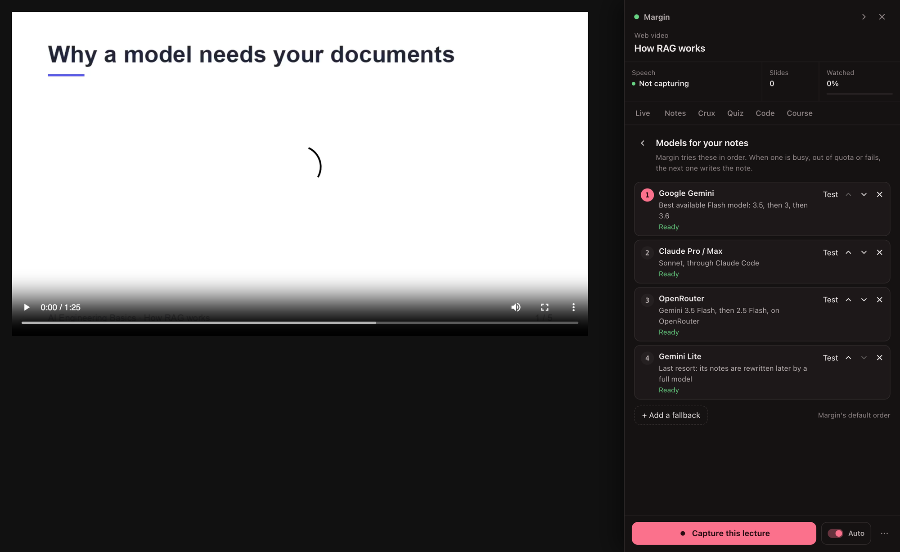
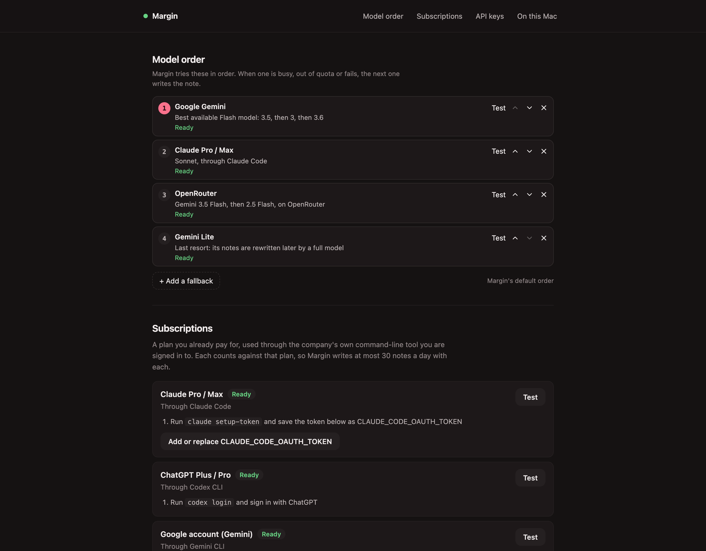

# Margin

**Watch a lecture. Get the notes.** Margin sits beside the video on Udemy, Coursera,
YouTube or any page with a video, keeps the lecture's own slides as they finish
building, follows what is said, and when the lecture ends writes a study note
into your Obsidian vault: the intuition first, the lecture's slides, diagrams,
formulas, questions to test yourself, and the lecture's code in a course
notebook, already run. Then it helps you keep it: the crux of the lecture (its
80/20), flashcards to quiz yourself on, and answers to your questions from the
lecture itself, linked to the moment it said so.



<sub>A real run, sped up: a short lecture plays, Margin keeps each slide as it finishes building, then writes
the note (with the lecture's own diagram next to one it drew), its crux, flashcards, and runs the code.</sub>

**[Download](https://github.com/saksham10arora-dotcom/Margin/releases/latest)** ·
[saksham.digital/margin](https://saksham.digital/margin) · macOS first; Linux works with `start.sh`

---

## What you get

- **A note per lecture, in your vault.** "In one breath" summary, the idea as an
  analogy before any formula, one section per topic linked to the moment in the
  video, KaTeX formulas with what every symbol means, Mermaid diagrams, tables,
  "Watch out", collapsed "Check yourself" questions, key terms.
- **The lecture's own slides**, captured the moment each finishes building, one
  image per slide however it builds up, and placed where they explain something.
  Works with a lecturer's face in a corner bubble.
- **Faithful, not invented.** Margin adds understanding (analogies, diagrams,
  questions), never content. Anything it makes up, like an example with its own
  numbers, is labelled as Margin's.
- **The code, run.** The lecture's code goes into one notebook per course, taken
  from the course's GitHub repo when it links one, otherwise read off the screen,
  and executed in a fresh kernel before it is saved. Code that needs your API
  keys, a local model server or big downloads is kept exactly as taught and
  marked for you to run.
- **One note, however you watch.** Start in the middle, reload, skip, rewatch:
  it all builds one record, and a later watch that catches something new rewrites
  the same note. Edits you make in Obsidian are never overwritten on Margin's own.
- **Lectures you finished before Margin** get notes from their captions, one
  click in the Course tab.
- **The crux, the 80/20.** Its own tab: the one idea the lecture exists to teach,
  the three to six that matter most, what to remember, and the line to keep if you
  forget everything else. Written with the note, and folded into it in your vault.
- **Ask the lecture.** Type a question and get the answer from what was actually
  said, with the moment linked: click it and the video jumps there. Something the
  lecture never covered is said to be so.
- **Quiz yourself.** The note becomes flashcards you flip in the panel: say whether
  you knew it, and the ones you missed come back until you know them all. Export
  them to [Anki](https://apps.ankiweb.net) in one click when you want spaced repetition.
- **A course, not a pile of files:** numbered notes linked previous and next, a
  course index, and YouTube playlists treated as courses.
- **Any model you have.** A free Gemini key, a subscription you already pay for
  (Claude, ChatGPT, Google, Cursor, GitHub Copilot, OpenCode, Qwen), any of 200+
  API providers, or a model on your own Mac. Put them in the order you want:
  when one is busy or out of quota, the next writes the note.

## How it looks

Every picture here is from one run on *How RAG works*, a short demo lecture made for them
(`scripts/e2e/make_lecture.py --demo`), so no one's course is in this README.

| While you watch | The note |
|---|---|
|  |  |
| **The crux: the 80/20 of the lecture** | **Ask the lecture, answered with the moment** |
|  |  |
| **Quiz yourself, then take the cards to Anki** | **The code, run in a fresh kernel** |
|  |  |
| **Your models, in order** | **Every model, searchable, with what it can do and costs** |
|  |  |

And a settings page for keys, subscriptions and local models:



## Install (about five minutes)

1. **Download** the latest `margin-<version>.zip` from
   [Releases](https://github.com/saksham10arora-dotcom/Margin/releases/latest) and unzip it
   somewhere it can stay (Chrome loads it from there).
2. **Run the installer** in Terminal, from the unzipped folder:
   ```bash
   ./install.sh
   ```
   It asks where to save notes (a folder in your Obsidian vault is best), sets up
   Margin's helper (the *sidecar*, which writes the notes), and on a Mac starts it at
   login so you never need a terminal again. If macOS asks whether "Margin Sidecar"
   may access a folder, click **Allow**.
3. **Load the extension.** In the Chrome page that opens (`chrome://extensions`):
   turn on **Developer mode**, click **Load unpacked**, choose the `extension` folder.
4. **Choose your models.** Open a lecture, then in the Margin panel **⋯ → Settings**.
   The quickest start is a free Gemini key from
   [aistudio.google.com](https://aistudio.google.com/apikey).

Needs Chrome (or Edge, Brave, Arc) and Python 3.11+ (the installer tells you how to
get it). For lectures without captions, also `brew install ffmpeg whisper-cpp` before running the
installer: it then offers the speech model (a one-time download of about 490 MB), and Margin
transcribes the audio on your Mac. Installed them later? `./scripts/setup.sh --whisper-model`.

## Updating

1. Download the new zip from [Releases](https://github.com/saksham10arora-dotcom/Margin/releases/latest)
   and unzip it over your Margin folder.
2. Run `./install.sh` again. It offers the notes folder you already use, keeps your keys and model
   order, and restarts Margin's helper so the new version is the one running.
3. Reload Margin in `chrome://extensions` (the circular arrow on its card).

Margin does not update itself, so watch the repo's releases if you want to hear about new ones.

## Choosing models

Margin tries your models in order: **1st, 2nd, 3rd...** When one is busy,
out of quota or fails, the next writes the note. Change the order in the panel
(**⋯ → Models**) or on the settings page. The default is Gemini, then Claude,
then OpenRouter, then Gemini Lite, using whichever of those you have set up.

| Kind | Examples | What you need |
|---|---|---|
| **Free** | Google Gemini | a free key from aistudio.google.com |
| **Subscriptions you already pay for** | Claude Pro/Max, ChatGPT Plus/Pro, Google account, Cursor, GitHub Copilot, OpenCode, Qwen | that company's command-line tool, signed in (the settings page shows the steps). Margin writes at most 30 notes a day with each |
| **API keys** | OpenAI, Anthropic, Groq, DeepSeek, Mistral, xAI, OpenRouter and 200+ more from [models.dev](https://models.dev) | a key, pasted on the settings page |
| **On your Mac** | Ollama, LM Studio, llama.cpp, vLLM, Jan | the app running with a model downloaded. Private and free, slower and usually weaker |

Keys you add are saved in `~/.margin/keys.env`, readable by you only, and never
shown again. Keys already in your environment or `~/.config/keys.env` are used too.
Models that cannot see images still write good notes from what is said; the
dropdown marks them "text only".

## Where it works

- **Udemy and Coursera:** capture starts by itself when a lecture plays.
- **YouTube:** Margin stays a small tab until you press **Capture this lecture**.
  Nothing about a video is stored before that, so your entertainment stays yours.
- **Anything else with a video:** the toolbar button or `Alt+Shift+M`.
- **Closed it with ×?** It stays closed on that lecture and opens again on the next;
  the toolbar button or `Alt+Shift+M` brings it back.

## Privacy

- Captures stay on your Mac (`~/.margin/sessions`). Audio is transcribed on your Mac.
- The only things that leave it are requests to the model you picked: the note
  (transcript and chosen slides), and, when you ask for them, a question or
  flashcards (with the transcript or note). Nothing at all with a local model.
- The sidecar only answers Margin's own extension; a website cannot read your
  notes from it, and only Margin's pages can change its settings.
- API keys travel in request headers, never URLs, so they never reach a log.

## How it works

```
 the lecture tab ──slides, captions, audio──▶ sidecar (on your Mac, port 8766) ──▶ your model order
        ▲                                        │                                    │
        └ Live, Notes, Crux, Quiz, Code, Course ◀┴── note + notebook in your vault ◀──┘
```

The extension reads the playing video directly (a tiny thumbnail twice a second
to spot when the screen settles on something new), the platform's captions, or
the video's own audio. The sidecar keeps one record per lecture, writes the note
with the first model in your order that answers, runs the code, and files
everything in your vault. See [ISSUES.md](ISSUES.md) for known limits.

## Troubleshooting

- **"Sidecar is not running"** in the panel: run `./scripts/login-item.sh status`
  in the Margin folder, or start it by hand with `./scripts/start.sh`.
- **"Margin needs a model"**: open **⋯ → Settings** and add a key or a subscription;
  **Test** next to each tells you if it answers.
- **Notes are slow or come from a "Lite" model**: Gemini gets overloaded at busy
  times. Add a second model in your order (a subscription is ideal); a note written
  by a Lite fallback is rewritten by a full model later on its own.
- **After updating**: reload Margin in `chrome://extensions`; open lecture tabs pick
  it up by themselves.
- **Dozens of near-identical slides for one lecture** (captured before 2.8.1, when a lecturer's
  moving head counted as a change): from the Margin folder, `venv/bin/python -m sidecar.sessions`
  shows what a clean-up would keep, and adding `--apply` does it. Notes already written keep their pictures.

## Configuration

| Variable | Default | |
|---|---|---|
| `MARGIN_VAULT_PATH` | `~/MarginNotes` | where notes go (the installer asks) |
| `MARGIN_PORT` | `8766` | the sidecar's port |
| `MARGIN_CLAUDE_DAILY` / `MARGIN_SUBSCRIPTION_DAILY` | `30` | most notes a day through each subscription |
| `MARGIN_AUTOLINK` | `1` | link concepts to notes already in your vault |
| `~/.margin/engines.toml` | none | extra OpenAI-compatible engines by hand; see `engines.example.toml` |

## Development

```bash
./scripts/setup.sh
npm install && npm test                          # extension tests
venv/bin/python -m pytest sidecar/tests -q       # sidecar tests
node scripts/e2e/run.mjs <lecture> <out>         # a whole lecture in a real browser
node scripts/e2e/resilience.mjs <lecture>        # extension reload and sidecar outage mid-lecture
node scripts/e2e/model-menu.mjs <lecture> <out>  # model order, dropdowns, settings page
./scripts/package-release.sh                     # the download zip
```

The README's pictures and GIF come from the demo lecture:

```bash
python3 scripts/e2e/make_lecture.py /tmp/rag --demo
node scripts/e2e/run.mjs /tmp/rag /tmp/rag-out --record   # screenshots, plus rec-play.webm and rec-note.webm
node scripts/e2e/model-menu.mjs /tmp/rag /tmp/rag-menu
```

The end-to-end tests drive the real extension in Chrome for Testing 131
(`npx @puppeteer/browsers install chrome@131`) against a generated lecture
(`scripts/e2e/make_lecture.py`: slides that build up, narration, captions or none).

## License

[Apache-2.0](LICENSE): use it anywhere, including at work. Made by [Saksham Arora](https://saksham.digital).
